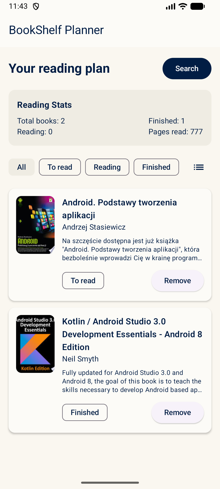
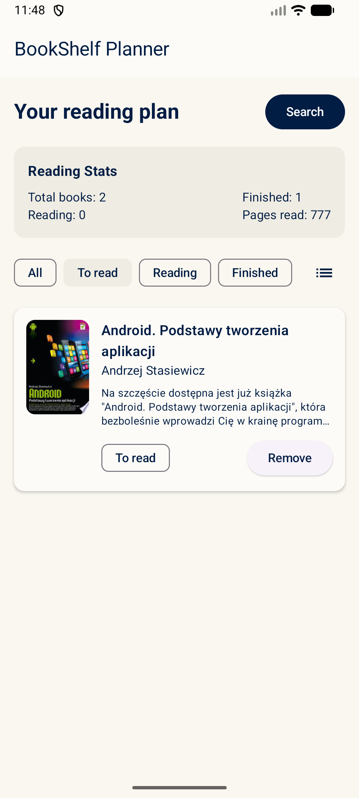
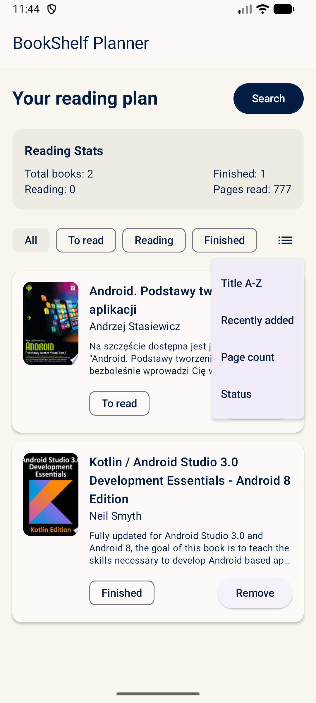
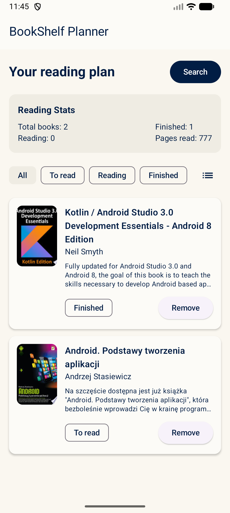
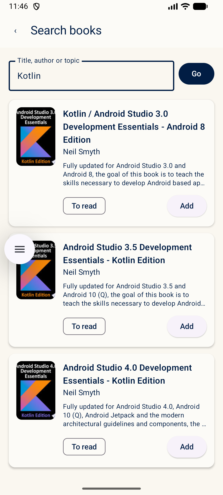
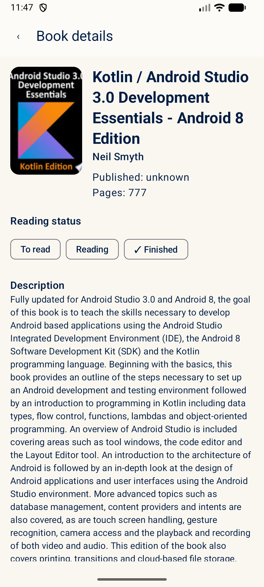
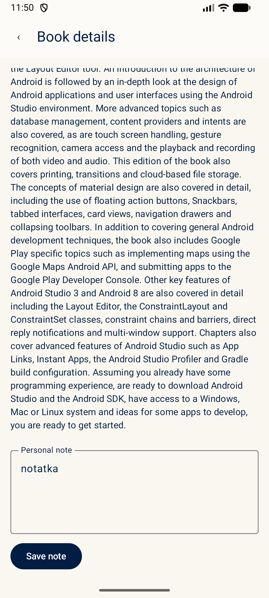

# BookShelf Planner

Simple Android application for keeping a personal reading list.
Search books on Google Books, save the ones you are interested in,
mark their reading status and add your own notes.

The app is written in Kotlin with Jetpack Compose and Room.

## Current status

The project has fully implemented:
- **MVVM Architecture** with manual DI (`AppContainer`).
- **Local SQLite database** using Room with data observation via Kotlin Flows (version 2 schema).
- **Dynamic network requests** to the Google Books API (Retrofit, Moshi, OkHttp), with optional API Key configured in `local.properties`.
- **Clean three-screen workflow** (Home, Search, Book Details) using Navigation Compose.
- **Reading Statistics Card** at the top of the Home screen displaying: total books, reading books, finished books, and total pages read.
- **Home list sorting** via a DropdownMenu (Title A-Z, Recently added, Page count, Status).
- **Visual Branding**: Custom app launcher icon (legacy, circular, adaptive format) and a tailored Material 3 theme color palette (deep navy, warm cream, muted green accents) with disabled elevation overlays.
- **Resilience**: Prevented duplicate searches, rapid spamming, and blank queries. Refactored error state handling to support robust offline and rate-limited environments.

## Features

- Search books by title, author or topic (Google Books API).
- Save selected books to a local list.
- Local persistence with Room (with safe fallback destructive migration).
- Three reading statuses: *To read*, *Reading*, *Finished*.
- Filter saved books by status.
- Add and edit a personal note for each book.
- Delete books from the list.
- Separate screens for Home, Search and Book details (Navigation Compose).
- Robust error handling for offline environments and API constraints to ensure UI stability.

## Screen Navigation

The application implements a multi-screen architecture powered by **Navigation Compose**:
- **NavHost Container**: The central navigation hub is configured inside `MainActivity.kt` using `rememberNavController()`.
- **Navigation Routes**:
  - `home` - The primary reading list screen showing saved books and reading statistics.
  - `search` - The search panel to query the Google Books API.
  - `detail/{bookId}` - The book details screen.
- **Dynamic Parameter Passing**: Navigation to details is managed using the route parameter `{bookId}` (typed as `NavType.StringType`). The parameter is dynamically extracted and used by the repository to fetch the respective book from the Room database.
- **Back Stack Management**: System back-button press and visual back indicators are wired via `navController.popBackStack()` to ensure standard Android behavior.

## Screenshots

Below is a visual overview of the BookShelf Planner interface and its key features:

| **Main Reading List (Home)** | **Status Filtering** |
|:---:|:---:|
|  <br> *Home screen displaying saved reading list, reading statistics card, and status filter chips.* |  <br> *Filter chips in action, showing only the books currently being read ("Reading" status).* |

| **Interactive Sorting** | **Sorted List View** |
|:---:|:---:|
|  <br> *Interactive sorting menu allowing the user to order books by Title, Date Added, Page Count, or Reading Status.* |  <br> *Saved books sorted in descending order by their page count.* |

| **Google Books Search** | **Details & Status** |
|:---:|:---:|
|  <br> *Search panel integrated with Google Books API, displaying search results as cards with covers and quick save options.* |  <br> *Book details screen containing comprehensive metadata, dynamic status selection, and personal reading notes.* |

| **Personal Notes** | **Branding & Theme** |
|:---:|:---:|
|  <br> *Editing and saving a personal note linked with the local Room database.* |  <br> *Custom launcher icon and cohesive Material 3 visual identity.* |

## Tech stack

- Kotlin
- Jetpack Compose + Material 3
- Navigation Compose
- ViewModel + Kotlin Coroutines / Flow
- Room (local database)
- Retrofit + Moshi (Google Books API)
- Coil (image loading)

## Project structure

```
app/src/main/java/com/dawidchmiel/bookshelfplanner/
├── MainActivity.kt
├── BookShelfApplication.kt
├── AppContainer.kt
├── model/                  # Book, BookStatus
├── data/
│   ├── local/              # Room: BookEntity, BookDao, BookDatabase, Converters
│   ├── remote/             # Retrofit: GoogleBooksApi, DTOs
│   └── repository/         # BookRepository
└── ui/
    ├── screens/            # HomeScreen, SearchScreen, BookDetailScreen, ViewModel, Components
    └── theme/              # BookShelfTheme, Theme
```

## Requirements

- Android Studio Ladybug or newer
- Android SDK 35
- JDK 17 (or Android Studio's embedded JBR)
- A device or emulator with Android 8.0 (API 26) or higher

## How to run

1. Clone the repository:
   ```bash
   git clone https://github.com/Kauszyn/bookshelf-planner.git
   ```
2. Open the project folder in Android Studio (open the root `bookshelf-planner` folder, not the `app` folder).
3. Wait for the Gradle sync to finish.
4. Pick an emulator or connect a device and press **Run**.

The Google Books API does not require an API key for basic search,
so no extra configuration is needed.

## Manual test scenario

1. Start the app.
2. Open **Search** and type for example `Kotlin` or `Clean Code`.
3. Add a few books to your list.
4. Go back to **Home**.
5. Open one of the saved books, change its status and save a note.
6. Close and reopen the app — the data should still be there.

## Planned improvements

- Search input debouncing.
- Snackbar confirmation after saving a book.
- Reading progress field (current page).
- Unit tests for the repository.
- Better empty-state graphics.

## License

This project is released under the MIT License. See [LICENSE](LICENSE) for details.
